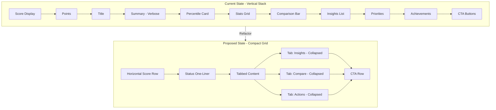

# Audit Card UX Improvement Plan

## Problem Summary

The AI Interface Readiness Audit card on the Lab page has several critical UX issues that create a poor user experience after quiz completion:

1. **Oversized Results Card** - The post-quiz results section expands vertically, forcing excessive scrolling
2. **Tight Question Card Padding** - Inner question cards lack breathing room
3. **Verbose Content** - Too much text creates friction and cognitive load
4. **Section Title Bloat** - The right-side section header takes disproportionate vertical space
5. **No Viewport Containment** - No max-height constraints to keep content within viewport

---

## Current State Analysis

### File Locations
- **Lab Page**: [`src/app/lab/page.js`](src/app/lab/page.js) - Lines 410-436 contain the AI Audit section
- **Quiz Component**: [`src/components/AIReadinessQuiz.js`](src/components/AIReadinessQuiz.js) - 949 lines total

### Current Structure Issues

#### 1. Results Section (Lines 621-850)
The results view stacks too many elements vertically:
```
- Score icon (80px)
- Score display
- Points display  
- Title
- Summary paragraph (verbose)
- Benchmarking section:
  - Percentile card
  - 2-column stats grid
  - Score comparison bar
  - Top performer insights list
- Priorities/Warnings sections
- Achievements section
- Streak display
- Share button
- CTA button
- Retake button
```

#### 2. Question Card (Lines 576-607)
- Padding: `py-4 sm:py-5 px-5 sm:px-6` - adequate but feels tight
- Fixed `minHeight: '60px'` - inflexible

#### 3. Section Header (Lines 415-428 in lab/page.js)
```jsx
<div className="relative z-10 max-w-2xl text-center mb-10 space-y-4">
  // Badge, Title, Description - takes ~150px vertical space
</div>
```

#### 4. Container Padding (Line 412 in lab/page.js)
```jsx
<div className="glass-premium rounded-[2.5rem] p-6 md:p-10 lg:p-16 ...">
```
Large padding values contribute to oversized appearance.

---

## Proposed Solutions

### Solution 1: Compact Results Layout

**Strategy**: Transform vertical stack into horizontal grid with progressive disclosure

```
┌─────────────────────────────────────────────────────────────┐
│  [Score Badge]  │  Score: 12/14  │  Percentile: Top 25%   │
│                 │  85 points     │  vs 8.5 avg            │
├─────────────────────────────────────────────────────────────┤
│  Status: AI-Ready ✓                                          │
│  Your UX foundation is solid for AI integration.            │
├─────────────────────────────────────────────────────────────┤
│  [Tab: Insights] [Tab: Compare] [Tab: Actions]              │
│  ─────────────────────────────────────────────────────────  │
│  • Top performers use tiered confidence states              │
│  • Focus on fine-tuning confidence communication           │
├─────────────────────────────────────────────────────────────┤
│  [Share Score]              [Get Detailed Report →]         │
└─────────────────────────────────────────────────────────────┘
```

**Implementation**:
1. Create horizontal score summary row (flexbox)
2. Use tabs for detailed content (Insights/Compare/Actions)
3. Collapse achievements into compact badges
4. Remove redundant "Next Step" sections
5. Consolidate benchmarking into single comparison row

### Solution 2: Question Card Improvements

**Current**:
```jsx
className="w-full text-left py-4 sm:py-5 px-5 sm:px-6 rounded-2xl border..."
style={{ minHeight: '60px' }}
```

**Proposed**:
```jsx
className="w-full text-left py-5 sm:py-6 px-6 sm:px-8 rounded-xl border..."
// Remove fixed minHeight, let content determine height
// Add subtle background: bg-card/30 hover:bg-card/50
```

### Solution 3: Section Header Reduction

**Current** (Lines 415-428):
```jsx
<div className="relative z-10 max-w-2xl text-center mb-10 space-y-4">
  <div className="inline-flex items-center gap-2 text-indigo-500 bg-indigo-500/10 px-4 py-2 rounded-full border border-indigo-500/20">
    <FaBrain className="w-4 h-4" />
    <span className="font-semibold tracking-wide uppercase text-xs">Interactive Tool</span>
  </div>
  <h3 className="text-3xl md:text-4xl font-bold text-foreground">
    AI Interface Readiness Audit
  </h3>
  <p className="text-muted-foreground text-lg">
    Assess your product's AI UX maturity and identify critical gaps in under 2 minutes.
  </p>
</div>
```

**Proposed**:
```jsx
<div className="relative z-10 w-full mb-6">
  <div className="flex items-center justify-between flex-wrap gap-4">
    <div className="flex items-center gap-3">
      <div className="w-10 h-10 rounded-xl bg-indigo-500/10 flex items-center justify-center border border-indigo-500/20">
        <FaBrain className="w-5 h-5 text-indigo-500" />
      </div>
      <div>
        <h3 className="text-xl md:text-2xl font-bold text-foreground">AI Readiness Audit</h3>
        <p className="text-sm text-muted-foreground">2 min assessment</p>
      </div>
    </div>
  </div>
</div>
```

### Solution 4: Viewport Containment

Add max-height constraint with internal scrolling:

```jsx
// In AIReadinessQuiz.js results section
<m.div
  key="results"
  className="text-center w-full max-w-[600px] mx-auto overflow-hidden"
  // Add max-height with scroll for large content
>
  <div className="max-h-[70vh] overflow-y-auto pr-2 scrollbar-thin">
    {/* Results content */}
  </div>
</m.div>
```

### Solution 5: Container Padding Reduction

**Current** (Line 412 in lab/page.js):
```jsx
<div className="glass-premium rounded-[2.5rem] p-6 md:p-10 lg:p-16 ...">
```

**Proposed**:
```jsx
<div className="glass-premium rounded-3xl p-6 md:p-8 lg:p-10 ...">
```

---

## Detailed Implementation Steps

### Step 1: Create Compact Score Summary Component

Extract the score display into a horizontal layout:

```jsx
const ScoreSummary = ({ score, maxScore, points, percentile, benchmarkData }) => (
  <div className="flex items-center justify-center gap-6 flex-wrap">
    {/* Score Circle */}
    <div className="flex items-center gap-3">
      <div className={`w-14 h-14 ${results.bgColor} rounded-xl flex items-center justify-center`}>
        <ResultIcon className={`w-7 h-7 ${results.color}`} />
      </div>
      <div className="text-left">
        <div className="text-2xl font-bold">{score}/{maxScore}</div>
        <div className="text-xs text-muted-foreground">{points} pts</div>
      </div>
    </div>
    
    {/* Divider */}
    <div className="w-px h-10 bg-border/50" />
    
    {/* Percentile */}
    <div className="text-left">
      <div className="text-lg font-semibold text-primary">{percentile}%</div>
      <div className="text-xs text-muted-foreground">percentile</div>
    </div>
  </div>
);
```

### Step 2: Create Tabbed Results Section

Replace vertical stack with tabs:

```jsx
const ResultsTabs = ({ results, answers, benchmarkData }) => {
  const [activeTab, setActiveTab] = useState('insights');
  
  return (
    <div className="w-full">
      {/* Tab Headers */}
      <div className="flex gap-1 p-1 bg-muted/30 rounded-lg mb-4">
        {['insights', 'compare', 'actions'].map((tab) => (
          <button
            key={tab}
            onClick={() => setActiveTab(tab)}
            className={cn(
              "flex-1 py-2 px-3 rounded-md text-sm font-medium transition-all",
              activeTab === tab 
                ? "bg-card text-foreground shadow-sm" 
                : "text-muted-foreground hover:text-foreground"
            )}
          >
            {tab.charAt(0).toUpperCase() + tab.slice(1)}
          </button>
        ))}
      </div>
      
      {/* Tab Content */}
      <AnimatePresence mode="wait">
        {activeTab === 'insights' && <InsightsTab ... />}
        {activeTab === 'compare' && <CompareTab ... />}
        {activeTab === 'actions' && <ActionsTab ... />}
      </AnimatePresence>
    </div>
  );
};
```

### Step 3: Consolidate Benchmarking

Replace multiple cards with single comparison row:

```jsx
const BenchmarkRow = ({ score, maxScore, averageScore }) => (
  <div className="bg-muted/30 rounded-lg p-3">
    <div className="flex items-center justify-between text-xs text-muted-foreground mb-2">
      <span>Your Score</span>
      <span>Industry Avg</span>
    </div>
    <div className="relative h-2 bg-muted rounded-full">
      {/* Average marker */}
      <div 
        className="absolute top-0 bottom-0 w-0.5 bg-muted-foreground/50"
        style={{ left: `${(averageScore / maxScore) * 100}%` }}
      />
      {/* User score */}
      <div 
        className="h-full bg-primary rounded-full"
        style={{ width: `${(score / maxScore) * 100}%` }}
      />
    </div>
    <div className="flex justify-between text-xs mt-1">
      <span className="font-medium">{score}</span>
      <span>{averageScore.toFixed(1)}</span>
    </div>
  </div>
);
```

### Step 4: Shorten Verbose Text

**Current summary text** (Lines 111-112):
```
"Your UX foundation is solid for AI integration. You've already built the trust, transparency, and error-handling patterns that AI interfaces require."
```

**Proposed**:
```
"Your UX is AI-ready. Trust and transparency patterns are in place."
```

### Step 5: Remove Redundant Sections

1. Remove duplicate "Next Step" sections (appears twice in current implementation)
2. Merge "Priorities" and "Warnings" into single "Actions" tab
3. Collapse achievements into inline badges below score
4. Remove streak display (low value, adds height)

---

## Responsive Behavior

### Mobile (< 640px)
- Single column layout
- Full-width tabs
- Stack score elements vertically if needed
- Reduced padding throughout

### Tablet (640-1024px)
- 2-column where appropriate
- Horizontal score summary
- Compact tabs

### Desktop (> 1024px)
- Full horizontal layout
- Side-by-side comparisons
- Optimal whitespace

---

## Visual Hierarchy Improvements

1. **Primary**: Score and status (largest, most prominent)
2. **Secondary**: Key insight/next action (medium emphasis)
3. **Tertiary**: Detailed comparisons and actions (subtle, expandable)

---

## Files to Modify

| File | Changes |
|------|---------|
| [`src/components/AIReadinessQuiz.js`](src/components/AIReadinessQuiz.js) | Major refactor of results section, add tabs, compact layout |
| [`src/app/lab/page.js`](src/app/lab/page.js) | Reduce section header, adjust container padding |

---

## Success Criteria

1. ✅ Results card fits within viewport without scrolling (max 80vh)
2. ✅ Question cards have comfortable padding (min 48px tap targets)
3. ✅ Section header reduced by 50% vertical space
4. ✅ Text reduced by 30% while maintaining clarity
5. ✅ All interactive elements remain accessible
6. ✅ Responsive behavior polished across breakpoints

---

## Architecture Diagram



---

## Risk Mitigation

| Risk | Mitigation |
|------|------------|
| Users miss detailed insights | Keep insights accessible via tabs, not hidden |
| Reduced text loses context | A/B test shortened copy, keep key information |
| Tabs add complexity | Use clear labels, default to most relevant tab |
| Mobile usability | Ensure tabs are tappable, content scrollable |

---

---

# Design Checklist Section Improvements

## Current State Analysis

### File Location
- **Lab Page**: [`src/app/lab/page.js`](src/app/lab/page.js) - Lines 346-408

### Current Structure Issues

#### 1. Excessive Container Padding (Line 348)
```jsx
<div className="glass-premium rounded-[2.5rem] p-8 md:p-12 lg:p-16 ...">
```
- `rounded-[2.5rem]` creates visual heaviness
- `p-8 md:p-12 lg:p-16` uses excessive padding at larger screens

#### 2. Verbose Header Section (Lines 353-367)
- Badge + Title + Description takes ~200px vertical space
- Title uses `text-3xl md:text-4xl lg:text-5xl` - oversized
- Description includes dynamic headline + static text

#### 3. Right Panel "What's Inside" (Lines 387-406)
- Full card with `p-8` padding
- Shows only 5 of 9 checklist items
- Could be more compact

---

## Proposed Solutions

### Solution 1: Reduce Container Padding

**Current**:
```jsx
<div className="glass-premium rounded-[2.5rem] p-8 md:p-12 lg:p-16 ...">
```

**Proposed**:
```jsx
<div className="glass-premium rounded-3xl p-6 md:p-8 lg:p-10 ...">
```

### Solution 2: Compact Header Layout

**Current** (Lines 353-367):
```jsx
<div className="relative z-10 flex-1 space-y-6 lg:max-w-xl">
  <div className="flex items-center gap-3 text-primary">
    <div className="w-10 h-10 rounded-xl bg-primary/10 ...">
      <FaClipboardCheck className="w-5 h-5" />
    </div>
    <span className="font-semibold tracking-wide uppercase text-xs">Essential Resource</span>
  </div>

  <h3 className="text-3xl md:text-4xl lg:text-5xl font-bold text-foreground leading-tight tracking-tight">
    The Developer-Ready <br />Design Checklist
  </h3>

  <p className="text-muted-foreground leading-relaxed text-lg">
    {headline} This 9-point checklist ensures your designs ship exactly as intended...
  </p>
```

**Proposed**:
```jsx
<div className="relative z-10 flex-1 space-y-4 lg:max-w-xl">
  <div className="flex items-center gap-3">
    <div className="w-10 h-10 rounded-xl bg-primary/10 flex items-center justify-center border border-primary/20">
      <FaClipboardCheck className="w-5 h-5 text-primary" />
    </div>
    <div>
      <h3 className="text-xl md:text-2xl font-bold text-foreground">Developer-Ready Design Checklist</h3>
      <p className="text-sm text-muted-foreground">9-point system • 80% fewer questions</p>
    </div>
  </div>

  <p className="text-muted-foreground leading-relaxed">
    {headline}
  </p>
```

### Solution 3: Compact "What's Inside" Panel

**Current**:
```jsx
<div className="bg-background/60 backdrop-blur-xl border border-border/50 rounded-3xl p-8 shadow-2xl shadow-primary/5">
  <h4 className="text-sm font-bold uppercase tracking-widest text-muted-foreground mb-6">What's Inside</h4>
  <ScrollRevealContainer ...>
    {checklistItems.slice(0, 5).map(...)}
  </ScrollRevealContainer>
</div>
```

**Proposed**:
```jsx
<div className="bg-background/60 backdrop-blur-xl border border-border/50 rounded-2xl p-5 shadow-xl shadow-primary/5">
  <h4 className="text-xs font-bold uppercase tracking-widest text-muted-foreground mb-4">What's Inside</h4>
  <ul className="space-y-3">
    {checklistItems.slice(0, 5).map((item, index) => (
      <li key={index} className="flex items-start gap-3">
        <FaCheckCircle className="w-4 h-4 text-primary shrink-0 mt-0.5" />
        <span className="text-sm text-foreground/90">{item}</span>
      </li>
    ))}
  </ul>
  <p className="text-xs text-muted-foreground mt-4">+ 4 more items</p>
</div>
```

---

# Overall Lab Page Improvements

## Page Structure Analysis

### Current Section Breakdown:
1. **Hero Section** (Lines 257-299): `py-20 md:py-32` - excessive
2. **Trust Strip** (Lines 301-308): Compact, acceptable
3. **Featured Resources** (Lines 311-439): Two large cards
4. **Resource Library** (Lines 442-600): Grid with sticky filters
5. **CTA Section** (Lines 602-637): `py-24 md:py-40` - excessive

---

## Proposed Page-Level Changes

### 1. Hero Section Padding Reduction

**Current**:
```jsx
<section className="py-20 md:py-32 relative overflow-hidden ...">
```

**Proposed**:
```jsx
<section className="py-16 md:py-24 relative overflow-hidden ...">
```

### 2. CTA Section Padding Reduction

**Current**:
```jsx
<section className="py-24 md:py-40 relative">
```

**Proposed**:
```jsx
<section className="py-16 md:py-24 relative">
```

### 3. Featured Resources Section Gap

**Current**:
```jsx
<div className="flex flex-col gap-12 lg:gap-16 pt-8">
```

**Proposed**:
```jsx
<div className="flex flex-col gap-8 lg:gap-10 pt-4">
```

### 4. Section Header Consolidation

Create a reusable compact section header component:

```jsx
const CompactSectionHeader = ({ icon: Icon, title, subtitle, badge }) => (
  <div className="flex items-center gap-4 mb-6">
    <div className="w-12 h-12 rounded-xl bg-primary/10 flex items-center justify-center border border-primary/20">
      <Icon className="w-6 h-6 text-primary" />
    </div>
    <div>
      {badge && <span className="text-xs font-semibold text-primary uppercase tracking-wide">{badge}</span>}
      <h3 className="text-xl md:text-2xl font-bold text-foreground">{title}</h3>
      {subtitle && <p className="text-sm text-muted-foreground">{subtitle}</p>}
    </div>
  </div>
);
```

---

## Visual Comparison

### Before:
```
┌─────────────────────────────────────────────────────────────┐
│                                                             │
│   [Badge: Essential Resource]                               │
│                                                             │
│   The Developer-Ready                                       │
│   Design Checklist                                          │
│                                                             │
│   Long description text that spans multiple lines           │
│   and includes dynamic headline content...                  │
│                                                             │
│   [Email Input                          ] [Get Checklist →] │
│                                                             │
│   👁 Preview PDF                                            │
│                                                             │
└─────────────────────────────────────────────────────────────┘
```

### After:
```
┌─────────────────────────────────────────────────────────────┐
│ [📋] Developer-Ready Design Checklist                       │
│      9-point system • 80% fewer questions                   │
│                                                             │
│ Short, punchy description with dynamic headline.            │
│                                                             │
│ [Email Input                          ] [Get Checklist →]   │
│ 👁 Preview                                                  │
└─────────────────────────────────────────────────────────────┘
```

---

## Complete File Change Summary

| File | Changes | Priority |
|------|---------|----------|
| [`src/components/AIReadinessQuiz.js`](src/components/AIReadinessQuiz.js) | Major refactor: compact results, tabs, reduced text | High |
| [`src/app/lab/page.js`](src/app/lab/page.js) | Reduce padding, compact headers, section spacing | High |
| [`src/components/LeadMagnetForm.js`](src/components/LeadMagnetForm.js) | Minor: ensure compact variants work well | Low |

---

## Implementation Order

1. **AIReadinessQuiz.js** - Results section refactor (highest impact)
2. **lab/page.js** - AI Audit section header reduction
3. **lab/page.js** - Design Checklist section compacting
4. **lab/page.js** - Page-level padding and spacing
5. **Testing** - Cross-breakpoint validation

---

## Success Metrics

| Metric | Current | Target |
|--------|---------|--------|
| Results card height | ~1200px | <600px (fit in viewport) |
| Question card padding | py-4/5 | py-5/6 |
| Section header height | ~150px | ~80px |
| Page scroll distance | ~4000px | ~2500px |
| Text reduction | N/A | 30% less verbose |

---

## Next Steps

1. **Switch to Code mode** to implement changes
2. Create new sub-components for modularity (ScoreSummary, ResultsTabs, BenchmarkRow)
3. Update AIReadinessQuiz.js with new compact layout
4. Update lab/page.js section headers and padding
5. Test across breakpoints (320px, 768px, 1024px, 1440px)
6. Validate accessibility (keyboard nav, screen reader)
